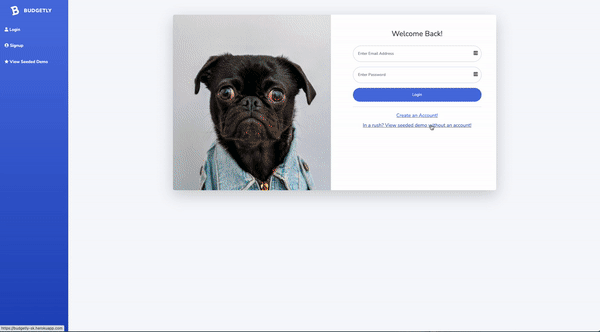

# Budgetly

Don't want to give your personal banking information to a budgeting app? Budgetly can help! Budgetly is for those that want a secure budgeting app that will help them develop a budgeting routine while also sacrificing no functionality. Budgetly will help you develop a budgeting mindset while also allowing you to track your investments!

 

# Tech Stack

Budgetly was built using React and Redux for state management on the front-end. All charts and styling were done with chart.js and Bootstrap. The back-end and database were done using Express, Sequelize, Postgres and Node.js.

# Setup & Start

1. Install dependencies: `npm install`
2. A few secret variables need to be defined before using the app. Make a .env file on the project's root folder and add the following:
   1. JWT="budgetlyApp"
   2. SEED_USER_PASS="budgetlyApp"
   3. YAHOO_FINANCE_API="Can get one for free from: https://www.yahoofinanceapi.com/"
3. Sync and seed your database by running `npm run seed`
4. Use `npm run start:dev` to start a local server (on port 8080)

# How to use

1. Dashboard will show all data analysis related to your budgeting, expenses, and investments
2. Update user settings and monthly income in Profile
3. Add and pay expenses in Expenses. Can pay an expense by just inputting the paid date
4. Add budgets in Budgets. Only one budget can be added for a month; the add new budget button will disappear if they're all being used. New budgets will be added to the selected date/year.
5. Add new investments in Investments

<h1 align='center'>
Demo here: https://budgetly-sk.herokuapp.com/
</h1>

# Developers

1. Sabi Kumar: https://github.com/skumar213 | http://www.linkedin.com/in/skumar213 | https://sabikumar.io
